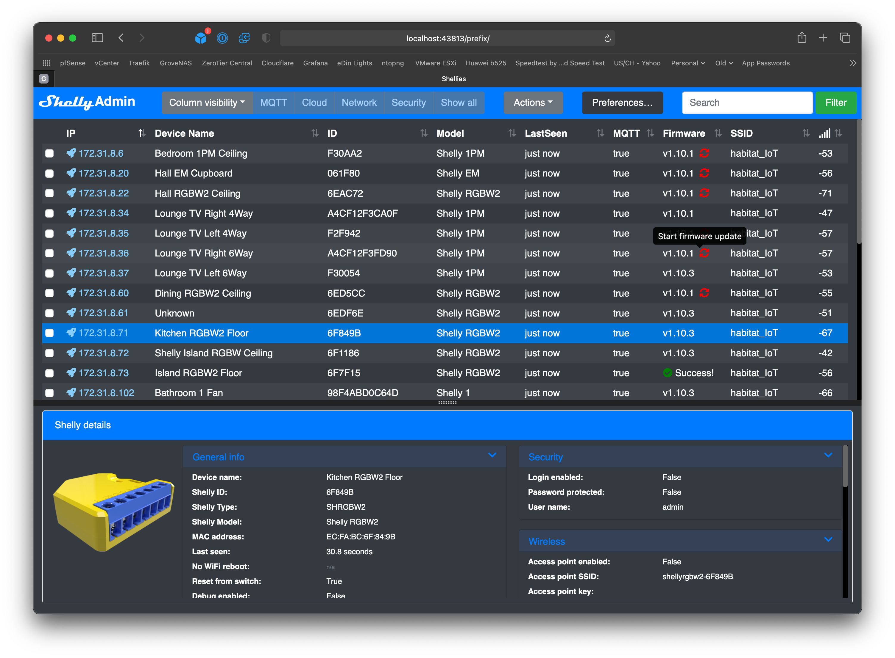
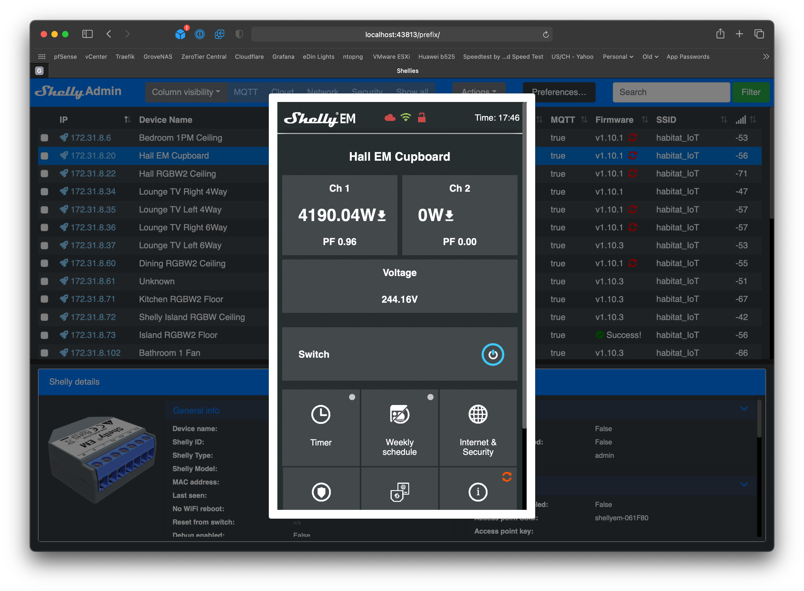

# Shelly Admin

Handles discovery and communication with [Shelly](https://shelly.cloud) devices, using both [CoAP](http://coap.technology) over HTTP and [MQTT](https://mqtt.org/).

An adminstration console written to manage a whole network of Shellys and to enure that their configuration is homogenous. The goal of the development is to deliver the application upon NodeJS/ExpressJS so that it can be deployed both as a "Add-On" to run within the HomeAssistant UI and also can be built using ElectronJS framework to make standalone platform native applications for MacOS, Windows, Linux and mobile.

The user interface is  entirely HTML5 and built upon Bootstrap 4 and Pug (née Jade) page templates. The design is fully responsive and reconfigures its layout dynamically so it is usuable even on a mobile device.

The applications, by design, does not work with or rely on Shelly Cloud. Device discovery is currently implemented via CoAP thanks to the awesome work of [Alexander Rydén](https://github.com/alexryd) for his contribution to the [Shellies](https://github.com/alexryd/node-shellies) NPM project. I fully intend to add MQTT discovery before first offical release and possibly IP range scanning if there is demand.

Not only does the application discover all your devices on teh local network, it also allows you to update the firware with a single click or open the device configuration page without messy tabs or navigation:

The user interface is designed to be dynamic and will automatically update in realtime as Shelly devices appear, change or go offline. Where possible this is acheived via push notifcations from each device using CoAP or MQTT but also falls back to the direct device API calls over http where push events are not supported.

This is prerelease software and is not yet feature complete. For ease of development this project is packaged as a NodeJS web server driving an HTML5 web browser (Safari, Chrome, Edge etc). The stand-alone Electron versions to deliver native binaries on MacOS and Windows will follow closer to functional completion.

I am looking for interested parties that would like to collaborate, either with pull requests or end-user testing. Please contact me by [email](email:shellyadmin@lyth.name) if you want to be involved or have any questions.
